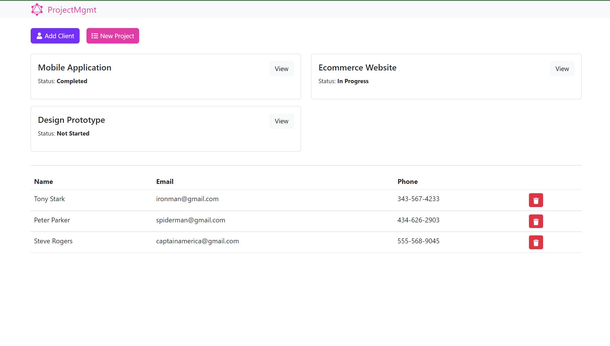

# ADOPT ME

This is a project from Brad Traversy GraphQL Crash Course.

## Table of contents

- [Overview](#overview)
  - [Functionalities](#functionalities)
  - [Screenshot](#screenshot)
- [My process](#my-process)
  - [Built with](#built-with)
  - [What I learned](#what-i-learned)
  - [Continued development](#continued-development)
  - [Useful resources](#useful-resources)
- [Setup](#setup)

## Overview

### Functionalities

Users should be able to:

- See a list of list Clients and Project
- Add new project and client
- Delete Project and Client
- View Project Details
- Update Project Info

### Screenshot

## My process

### Built with

- Semantic HTML5 markup
- CSS custom properties
- Flexbox
- Mobile-first workflow
- [Bootstrap](https://getbootstrap.com/) - CSS Library
- [React](https://reactjs.org/) - JS library
- [Node](https://nodejs.org/en/) - JavaScript runtime environment
- [GraphQL](https://graphql.org/) - query language
- [MongoDB](https://www.mongodb.com/home)

### What I learned

- How to set up a full stack application with Node Express and GrpahQL on the server and React, Apollo Client on the client side.

### Continued development

- Better Design
- Use Tailwind

### Useful resources

- [Course URL](https://www.youtube.com/watch?v=BcLNfwF04Kw)

### Setup

To setup project locally:

- in the main folder run `npm install` then `npm run dev`

- cd into `client`, run `npm install` then `npm start`
